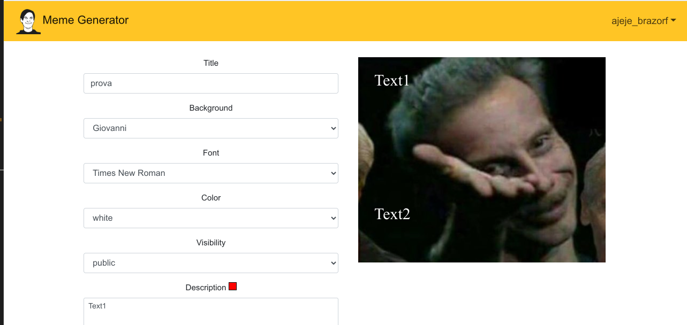

# Exam #2: "Meme Generator"
## Student: De Giorgi Lorenzo 

## React Client Application Routes

- Route `/`: show the list of all memes. If the user is logged in, it shows both protected and public otherwise only public memes.
- Route `/show`: show a specific meme pass through location.state
- Route `/login`: show login web page
- Route `/create`: show the form for meme creation. If the user copied a meme it accepts a state {selectedMeme: memeObject }

## API Server

- GET `/api/memes`
  - request parameters and request body content: req.user (optional)
  - response body content: list of meme objects or error object
- POST `/api/meme/add`
  - request parameters and request body content: a meme object as request body content
  - response body content: the meme added or error object
- DELETE `/api/delete/:id`
  - request parameters and request body content: the id of meme to be deleted as parameter
  - response body content: none if successfull, error object if some error occurs
- POST `/api/sessions`
  - request parameters and request body content: credentials as body content
  - response body content: info object about the user just logged in or error object
- GET `/api/sessions/current`
  - request parameters and request body content: \
  - response body content: info object about the user logged in or error object
- DELETE `/api/sessions/current`
  - request parameters and request body content: \
  - response body content: \

## Database Tables

- Table `meme` - contains information about the memes (id, title, creator, color, font, textarea contents, visibility, date and background image to be used)
- Table `users` - contains information about the users (id, username, email and hashed password)
- Table `sqlite_sequence` - additional information about the database automatically created by sqlite

## Main React Components

- `App` (in `App.js`): it is the main components. It handle the general behaviour, the routing, API requests and login/logout functionalities
- `MemeDisplay` (in `memeDisplay.js`): it is in charge of generate the meme; thus the background image and the textarea below it.
- `MemeShow` (in `memeShow.js`): it display the main properties of the meme (creator, date, visibility...) and, through MemeDisplay, it display the meme itself.
- `MemeList` (in `memeList.js`): it shows the list of all meme (or only the public one), each one with the controls to copy and delete them and some properties.
- `MemeGeneration` (in `memeGeneration.js`): it shows the form for creating the meme
- `NavigationBar` (in `NavigationBar.js`): it display the navigation bar on top of each page. It contains also the name of the logged user or the link to the login page
- `LoginForm` (in `loginForm.js`): it display the form for the login

## Screenshot

## Users Credentials

- username: lorenzodeg , password: password
- username: userprova, password: userdiprova
- username: ajeje_brazorf, password: qwertyu

